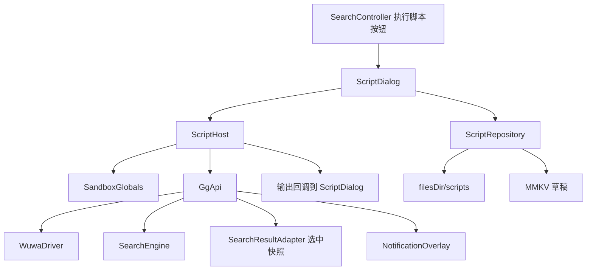

# Lua 脚本执行

Feature Name: lua-script-execution
Updated: 2026-09-09

## Description

在搜索页工具栏「执行脚本」接入第一版 Lua 运行时。用户在悬浮窗对话框中编辑脚本，由 Luaj 在后台线程执行；脚本通过 `gg.*` 读写当前绑定进程内存、读取搜索结果，并通过 `print` / `gg.toast` 反馈。本版本不实现 ImGui、搜索/精炼 API。

## Architecture



点击「执行脚本」打开 `ScriptDialog`。运行时 `ScriptHost` 创建沙箱 `Globals`，注入 `gg` 表与自定义 `print`。内存读写走现有 `WuwaDriver` 与 `ValueTypeUtils`。搜索结果走 `SearchEngine.getResults`；勾选项由 Controller 在启动执行前做快照传入。脚本文件存应用私有目录，编辑草稿用 MMKV。

## Components and Interfaces

### ScriptDialog

位置：`app/src/main/java/moe/fuqiuluo/mamu/floating/dialog/ScriptDialog.kt`

继承 `BaseDialog`。布局：标题、多行编辑框、只读输出区、载入/保存/运行/停止/关闭。编辑框使用系统输入法（脚本需要字母与符号）。打开时从 MMKV 恢复草稿；文本变化时写回草稿。关闭时调用 `ScriptHost.stop()`。

`SearchController.setupToolbar` 中「执行脚本」改为 `showScriptDialog()`，传入：

- `getSelectedResults: () -> List<SearchResultItem>`
- `notification: NotificationOverlay`

### ScriptHost

位置：`app/src/main/java/moe/fuqiuluo/mamu/script/ScriptHost.kt`

职责：编译并执行 Lua 源码、超时、中断、把输出切回主线程。

```kotlin
class ScriptHost(
    private val mainHandler: Handler,
    private val timeoutMs: Long = 60_000L
) {
    fun execute(source: String, api: GgApiBridge, onOutput: (String) -> Unit, onFinished: (ScriptEndReason) -> Unit)
    fun stop()
    val isRunning: Boolean
}
```

`ScriptEndReason`: `Completed` / `Stopped` / `Timeout` / `Error(message, line)`。

中断方式：安装 `DebugLib`，每 1000 条指令检查 `cancelled` 与超时，抛出 `LuaError`。执行线程在 `stop()` 后若 2 秒仍存活则 `interrupt()`。

### SandboxGlobals

位置：`app/src/main/java/moe/fuqiuluo/mamu/script/SandboxGlobals.kt`

使用 `org.luaj.vm2.Globals`，只加载：

- `BaseLib`（覆盖 `print`、移除 `dofile` / `loadfile`）
- `PackageLib`（禁用 `loadlib` 与 `java` 搜索路径）
- `Bit32Lib`、`TableLib`、`StringLib`、`MathLib`

不加载 `LuajavaLib`、`JseIoLib`、`JseOsLib`、`CoroutineLib`、`JseProcessLib`。

依赖：`org.luaj:luaj-jse:3.0.1`。

### GgApiBridge

位置：`app/src/main/java/moe/fuqiuluo/mamu/script/GgApiBridge.kt`

把 Kotlin 能力挂到 Lua `gg` 表。

| Lua | 行为 |
|---|---|
| `gg.TYPE_BYTE = 1` | 与 GG 常量一致 |
| `gg.TYPE_WORD = 2` | |
| `gg.TYPE_DWORD = 4` | |
| `gg.TYPE_QWORD = 32` | |
| `gg.TYPE_FLOAT = 16` | |
| `gg.TYPE_DOUBLE = 64` | |
| `gg.getTargetInfo()` | 已绑定返回 `{pid, processName}`，否则 `nil` |
| `gg.readValue(address, type)` | 读内存；失败返回 `nil` |
| `gg.writeValue(address, value, type)` | 写内存；返回 boolean |
| `gg.toast(message)` | 主线程 `NotificationOverlay.showSuccess` |
| `gg.getResults(maxCount)` | `SearchEngine.getResults(0, n)` 转 Lua 表 |
| `gg.getSelectedResults()` | 使用启动时快照 |

`address` 接受 number 或十六进制字符串（`0x...`）。64 位地址优先用字符串，避免 Lua number 精度丢失。

`type` 只接受上表六个 Type Flag；其它值视为运行时错误。

读写实现：`DisplayValueType` 映射后调用 `WuwaDriver.readMemory` / `writeMemory`，编解码复用 `ValueTypeUtils`。

结果表项：`{address = "0x...", value = "...", flags = TYPE_DWORD}`。`address` 用十六进制字符串。

### ScriptRepository

位置：`app/src/main/java/moe/fuqiuluo/mamu/script/ScriptRepository.kt`

- 目录：`context.filesDir/scripts`
- `list(): List<String>` 文件名
- `save(name: String, content: String)`
- `load(name: String): String`
- 草稿：MMKV key `script_editor_draft`

保存时若文件名不含 `.lua` 则追加。非法文件名（路径分隔符）拒绝保存。

### SearchController 改动

`SearchController.kt` 执行脚本按钮改为打开 `ScriptDialog`。`cleanup()` 与 `adjustLayoutForOrientation` 按现有 Search/Fuzzy/Pointer 对话框模式释放 `scriptDialog`。

## Data Models

```kotlin
data class ScriptResultItem(
    val address: Long,
    val value: String,
    val flags: Int
)

enum class ScriptEndReason {
    Completed, Stopped, Timeout
}

data class ScriptError(
    val message: String,
    val line: Int?
)
```

Type Flag 映射：

| Flag | DisplayValueType | 字节数 |
|---|---|---|
| 1 | BYTE | 1 |
| 2 | WORD | 2 |
| 4 | DWORD | 4 |
| 32 | QWORD | 8 |
| 16 | FLOAT | 4 |
| 64 | DOUBLE | 8 |

## Correctness Properties

- 同一时刻最多一个 Script Host 在运行
- 沙箱 Globals 中不存在 `luajava`、`io`、`os.execute`、`dofile`、`loadfile`
- `gg.writeValue` 失败时目标进程内存保持调用前状态
- 未绑定进程时读写 API 不调用 `WuwaDriver.writeMemory`
- 对话框关闭后 `ScriptHost.isRunning == false`
- `gg.getSelectedResults` 返回的列表与点击运行瞬间的勾选集合一致
- `gg.getResults(n)` 返回条数不超过 `min(n, SearchEngine.getTotalResultCount())`

## Error Handling

| 场景 | 处理 |
|---|---|
| 脚本为空 | 不启动 Host，输出「脚本为空」 |
| 语法/运行时错误 | 停止 Host，输出 `错误: 行x: message` |
| 未绑定进程读写下 | 返回 `nil` / `false`，输出一行警告 |
| 用户停止 | 2 秒内结束，输出「已停止」 |
| 超过 60 秒 | 输出「执行超时」 |
| 保存空文件名 | 提示并保持对话框 |
| 载入目录为空 | 提示「没有已保存的脚本」 |
| Luaj 初始化失败 | 输出「脚本引擎不可用」 |

## Test Strategy

单元测试（Kotest FunSpec，纯逻辑，不跑 JNI）：

1. Type Flag 与 `DisplayValueType` 双向映射
2. 地址解析：十进制、`0x` 十六进制、非法字符串
3. 沙箱：源码访问 `luajava` / `io` / `os` 得到 LuaError
4. 空脚本拒绝执行
5. `getResults` 截断到 `maxCount`
6. 文件名消毒：拒绝 `../` 与路径分隔符

不在 JVM 单测中覆盖 `WuwaDriver` 真实读写。

## References

[^1]: (Filename) - Search toolbar empty callback `app/src/main/java/moe/fuqiuluo/mamu/floating/controller/SearchController.kt`
[^2]: (Filename) - Memory R/W facade `app/src/main/java/moe/fuqiuluo/mamu/driver/WuwaDriver.kt`
[^3]: (Filename) - Search results `app/src/main/java/moe/fuqiuluo/mamu/driver/SearchEngine.kt`
[^4]: (Filename) - Value codec `app/src/main/java/moe/fuqiuluo/mamu/utils/ValueTypeUtils.kt`
[^5]: (Filename) - Dialog base `app/src/main/java/moe/fuqiuluo/mamu/floating/dialog/BaseDialog.kt`
[^6]: (Website) - Luaj JSE 3.0.1 `https://central.sonatype.com/artifact/org.luaj/luaj-jse/3.0`
